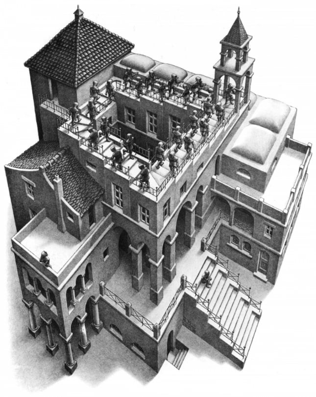

```{r setup, include=FALSE, warning=FALSE}
options(
  htmltools.dir.version = FALSE,
  width = 100
)
knitr::opts_chunk$set(echo = TRUE)
```

```{r, include = FALSE}
library(medfate)
library(sp)
```

class: title-slide

# 1.1 - Introduction to process-based forest modelling

## Miquel De Cáceres

### Ecosystem Modelling Facility

### `r as.Date("2022-06-13")`




---
class: center, middle

<div class=my-header>
    
</div>

<div class=my-footer></div>


# Outline

##  1. Fundamental concepts
##  2. Modelling process
##  3. Overview of process-based models


---
layout: true

<div class=my-header>
    
</div>

<div class=my-footer></div>

# 1. Fundamental concepts

---

---
layout: false
class: back-slide


## M.C. Escher - Ascending and Descending, 1960

.center[

]


