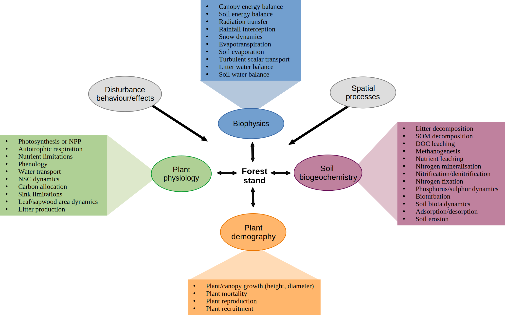
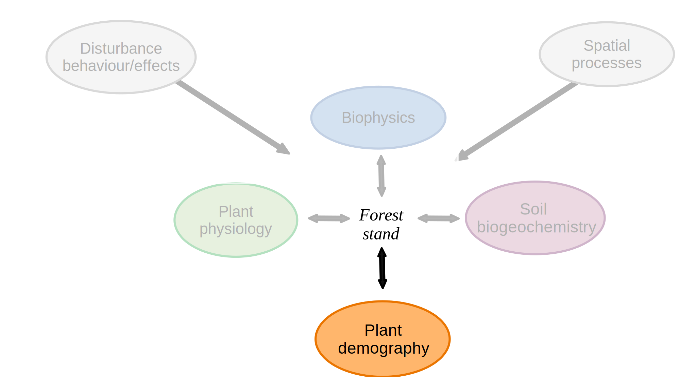
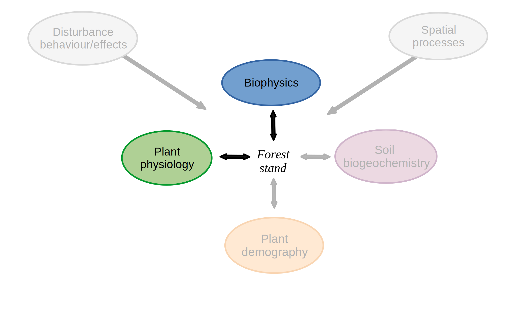
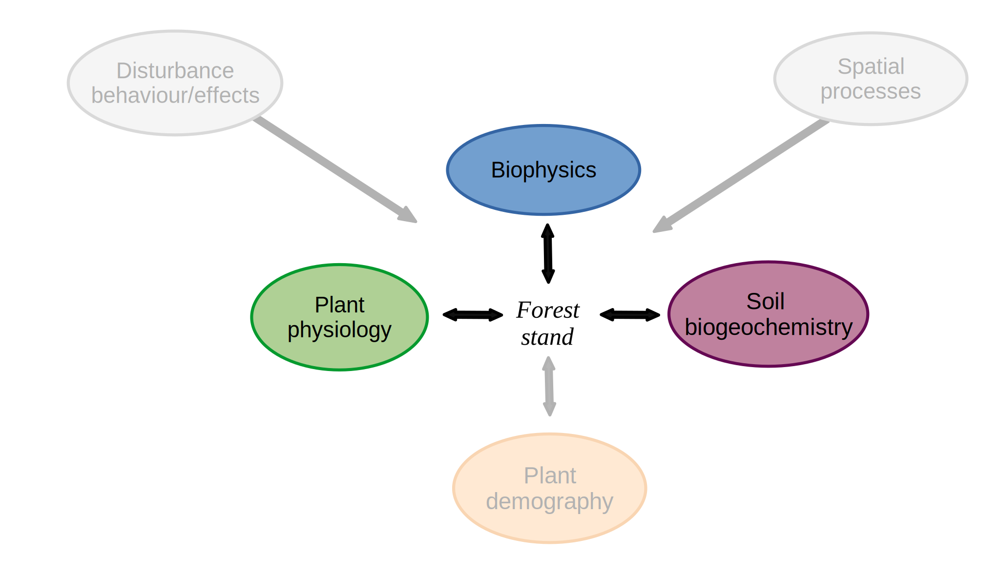
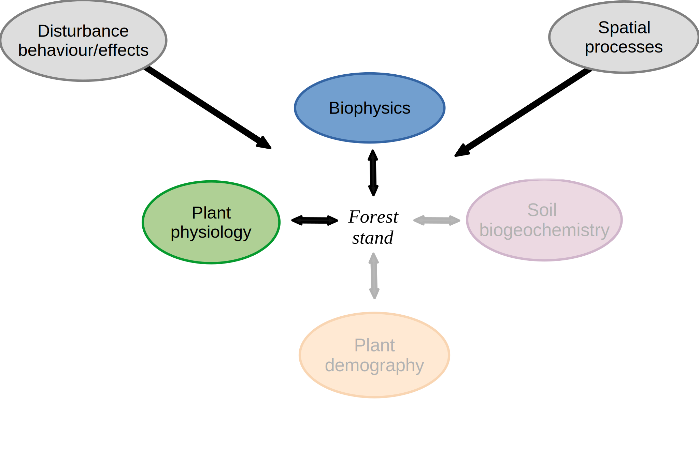

```{r setup, include=FALSE, warning=FALSE}
options(
  htmltools.dir.version = FALSE,
  width = 100
)
knitr::opts_chunk$set(echo = TRUE)
```

```{r, include = FALSE}
library(medfate)
library(sp)
```

class: title-slide

# 1.1 - Introduction to process-based forest modelling

### Miquel De Cáceres, Victor Granda, Aitor Ameztegui

### Ecosystem Modelling Facility

### `r as.Date("2022-06-13")`


---
class: center, middle

<div class=my-header>
    
</div>

<div class=my-footer></div>


# Outline

##  1. Fundamental concepts
##  2. Modelling life-cycle
##  3. Overview of process-based forest models


---
layout: true

<div class=my-header>
    
</div>

<div class=my-footer></div>

# 1. Fundamental concepts

---

.pull-left[
### Definitions

.font90[
+ *Model* - A simplification of reality that is constructed to gain insights into select attributes of a physical, biological, economic, or social system.

+ *Statistical model* - A model built using observations within a probabilistic framework.

+ *Mechanistic (or process-based) model* -  A model whose structure explicitly represents an understanding of physical, chemical, and/or biological processes.

+ *Simulation model* -  A model that represents the development of a solution by incremental steps through the model domain.

+ *State variables* - The dependent variables calculated within a model, which are also often the performance indicators of the models that change over the simulation.

+ *Parameters* - Terms in the model that are fixed during a model run or simulation but can be changed in different runs.
]
]

--

.pull-right[
### Model assessment
.font90[
+ *Verification* - Examination of the algorithms/implementation to ascertain that they truly represent the conceptual model and that there are no inherent numerical problems.

+ *Qualitative assessment* - Uncertainty in model predictions that cannot be quantified (i.e. about the theory underlying the model or the model design).

+ *Uncertainty analysis* - Investigation of the effects of lack of knowledge or potential errors on the model output.

+ *Robustness* - The capacity of a model to perform well across the full range of environmental conditions for which it was designed.
Screening

+ *Sensitivity* - The degree to which the model outputs are affected by changes in selected input parameters.

+ *Transparency* - The clarity and completeness with which data, assumptions, and methods of analysis are documented.

]
]

---
layout: true

<div class=my-header>
    
</div>

<div class=my-footer></div>

# 2. Modelling life-cycle

---


.pull-left[
.font90[
1. *Problem identification and formulation*
  + Definition of research/application objectives
  + Spatio-temporal physical domain

3. *Model identification/selection*
  + Data availability
  + Use of existing vs. new model
  
4. *Model development/modification*
  + Conceptual model
  + Model design
  + Implementation
  + Parameter estimation/calibration
  
5. *Model evaluation*
  + Peer review
  + Sensitivity/uncertainty analysis
  + Model corroboration
  
6. *Model application*
  + Simulation and documentation
  + Quantifying uncertainty
  + Evidence for decision
]
]

.pull-right[
  
]

---
layout: true

<div class=my-header>
    
</div>

<div class=my-footer></div>

# 2. Overview of process-based forest models

---

## A typology of forest processes

  

---

.pull-left[
.center[
### Forest gap models
  
  
  .font80[e.g., FORCLIM, FORCEEPS, GREFOS]
]
]

--
.pull-right[
.center[
### Soil-vegetation-atmosphere transfer model
  
  
  .font80[e.g., BILJOU, MuSICA, CANVEG]
]
]

--
.pull-left[
.center[
### Forest biochemical model
  
  
  .font80[e.g., CASTANEA, GOTILWA+, FOREST-BGC]
]
]

--

.pull-right[
.center[
### Watershed ecohydrological model
  
  
  .font80[e.g., RHESYS, ECH2O, Tethys-Chloris]
]
]


---
layout: false
class: back-slide


## M.C. Escher - Ascending and Descending, 1960

.center[

]


