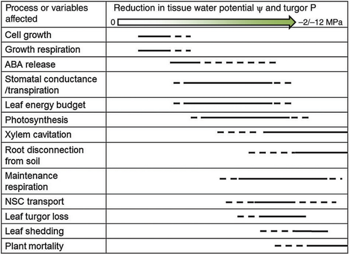
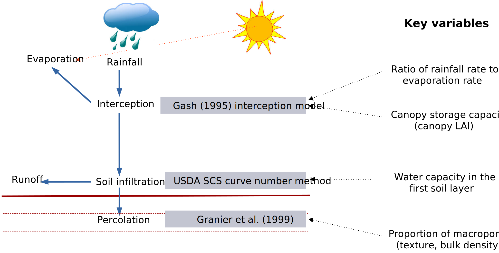
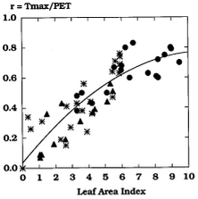
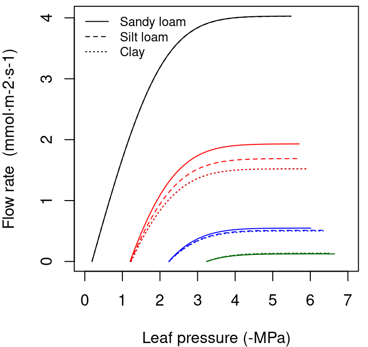
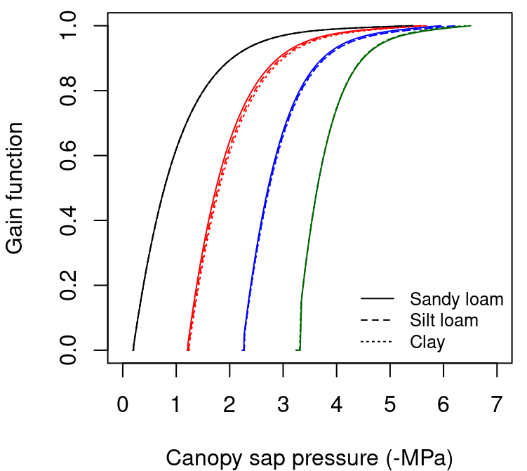

```{r setup, include=FALSE, warning=FALSE}
options(
  htmltools.dir.version = FALSE,
  width = 100
)
knitr::opts_chunk$set(echo = TRUE)
```

```{r, include = FALSE}
library(medfate)
library(sp)
library(ggplot2)
```

class: title-slide

# 2.1 - Forest water and energy balance (theory)

### Miquel De Cáceres, Victor Granda

### Ecosystem Modelling Facility

### `r as.Date("2022-12-01")`


---
class: center, middle

<div class=my-header>
    
</div>

<div class=my-footer></div>


# Outline

##  1. Preliminary concepts
##  2. Forest water balance in medfate
##  3. Transpiration and photosynthesis under the basic model
##  4. Transpiration and photosynthesis under the advanced model
##  5. Plant drought stress and cavitation
##  6. Basic vs. advanced models: a summary of differences


---
layout: true

<div class=my-header>
    
</div>

<div class=my-footer></div>

# 1. Preliminary concepts

---

## Water potential

The water potential, $\Psi$, is the potential energy of water relative to pure water under reference conditions. It quantifies the tendency of water to move from one area to another.

--

It has pressure units (e.g. MPa) and can be divided into different components:

.center[
  
]

--

But not all components are equally relevant in all contexts

---

## Soil water retention curves

The *water retention curve* of a soil (or *soil moisture characteristic curve*) is the relationship between volumetric soil moisture content ( $\theta$ in $m^3 \cdot m^{-3}$ of soil excluding rock fragments) and the corresponding soil water potential ( $\Psi$, in MPa)

--

Two water retention curve models are available in **medfate**:

.pull-left[

.font90[
1. *Saxton model*:  
$$\theta(\Psi) = (\Psi/A)^{(1/B)}$$
where $A$ and $B$ depend on the texture and, if available, organic matter in the soil.

2. *Van Genuchten model*:
$$\theta(\Psi) = \theta_{res}+\frac{\theta_{sat}-\theta_{res}}{\left[1+ (\alpha \cdot \Psi)^n \right]^{1-1/n}}$$
where $\theta(\psi)$ is the water retention, $\theta_{sat}$ is the saturated water content, $\theta_{res}$ is the residual water content, $\alpha$ is related to the inverse of the air entry pressure, and $n$ is a measure of the pore-size distribution.
]
]

.pull-right[
```{r retention-curves, fig.align='center', fig.width=4.5, fig.height=4, echo = FALSE}
soil_retentionCurvePlot(soil(defaultSoilParams()), model="both")+
  theme(legend.position =c(0.7,0.8))
```
]


---

## Water potential drop in plants

When stomata are closed (e.g. pre-down), plant leaf water potential is assumed to be in equilibrium with the water potential in the rhizosphere (neglecting gravity effects).

--

When stomata are open, a larger transpiration flow (*E*) implies (in steady state) a larger drop in water potential along the transpiration pathway:

.center[
  
]

<div class=citation-right> Venturas et al. (2017). J. Int. Pl. Biol., 59, 356-389.</div>

---

## Drought impacts on plants

The decrease in soil water potential caused by drought has multiple effects on plants, with some processes ceasing to occur and others becoming important or being promoted, depending on the plant response strategy.

.pull-left[
  
]
.pull-right[
  
]

<div class=citation-left> Choat et al. (2018). Nature, 558, 531-539. </div>
<div class=citation-right> Fatichi et al. (2016). WIRE: Water, 3, 327-368. </div>

---
layout: true

<div class=my-header>
    
</div>

<div class=my-footer></div>

# 2. Forest water balance in medfate

---

## Water balance components

The water balance models in available in medfate simulate the following vertical water flows in a given forest stand.

.center[
  
]

--

Variations in soil water content can be summarized as:

$$\Delta{V_{soil}} = Pr + Sm - In - Ru - Dd - Es - Ex$$

---

## Soil water inputs

If rainfall occurs during a given day, three processes are simulated to update the water content in soil layers:

.center[
  
]

---

## Soil water outputs

Regardless of precipitation, soil moisture can be modified due to the following processes:

.center[
  
]

--

Soil water uptake by plants and transpiration are modelled differently depending on the water balance model: **basic** vs **advanced**.

--

Hydraulic redistribution is only simulated in the advanced water balance model.

---
layout: true

<div class=my-header>
    
</div>

<div class=my-footer></div>

# 3. Transpiration and photosynthesis under the basic model

---

## Maximum transpiration
### Maximum canopy transpiration

Maximum canopy transpiration $Tr_{\max}$ depends on potential evapotranspiration, $PET$, and the amount of transpirating surface, i.e. the stand leaf area index, thanks to:

.pull-left[
$$\frac{Tr_{\max}}{PET}= -0.006\cdot (LAI^{\phi}_{stand})^2+0.134\cdot LAI^{\phi}_{stand}$$

and therefore:

$$Tr_{\max} = PET \cdot \left( -0.006\cdot (LAI^{\phi}_{stand})^2+0.134\cdot LAI^{\phi}_{stand} \right)$$

]
.pull-right[
.right[

]]

<div class=citation-right> Granier et al. (1999). Ecol. Model., 116, 269-283. </div>

--

### Maximum plant transpiration

Maximum canopy transpiration is divided among plant cohorts according to the amount of light absorbed by each one:

$$Tr_{\max, i} = Tr_{\max} \cdot \frac{f_i^{0.75}}{\sum_{j}{f_j^{0.75}}}$$
where $f_i$ is the fraction of total absorbed short-wave radiation that is due to cohort $i$.

---

## Actual plant transpiration

Actual plant transpiration depends on soil moisture and is calculated for each soil layer  $s$ separately.

--

.pull-left[
A *relative whole-plant water conductance*, $K$ is defined for any given soil layer $s$ using: 

$$K(\Psi_s) = \exp \left \{\ln{(0.5)}\cdot \left[ \frac{\Psi_{s}}{\Psi_{extract}}\right] ^r \right \}$$

where $\Psi_{extract}$ is the water potential at which transpiration is 50% of maximum, and $\Psi_s$, the water potential in layer $s$.
]

.pull-right[

```{r, fig.width=4, fig.height=3.5, fig.align="center", echo=FALSE}
par(mar=c(4,4,1,1))
x = seq(-10, 0, by=0.01)
plot(-x ,unlist(lapply(x,hydraulics_psi2K,-2.0,3.0)), type="l", ylab="K (relative conductance)", xlim=c(0,10), ylim=c(0,1),xlab="Soil water potential (-MPa)", frame=FALSE)
lines(-x, unlist(lapply(x,hydraulics_psi2K,-3.0,3.0)), lty=2)
lines(-x, unlist(lapply(x,hydraulics_psi2K,-4.0,3.0)), lty=3)
lines(-x, unlist(lapply(x,hydraulics_psi2K,-5.0,3.0)), lty=4)
legend("topright", lty=1:4, col=c(rep("black",4)), 
       legend = paste("Psi_extract = ", c(-2.0,-3.0,-4.0, -5.0), "MPa"), bty="n", cex=0.8)
abline(h=50, col="gray", lwd=2)
```
]

--

The water extracted by a plant cohort from soil layer $s$ and transpired, $Tr_{s}$, is the product:

$$Tr_{s} =  Tr_{\max} \cdot K(\Psi_{s}) \cdot FRP_{s}$$
where $FRP_{s}$ is the proportion of plant fine roots in layer $s$. 

--

The transpiration summed across soil layers is: 
$$Tr = \sum{Tr_s}$$

---


## Plant photosynthesis

Gross photosynthesis for a plant cohort, $A_g$, is estimated as a function of transpiration, $Tr$, using:

$$A_{g} = Tr \cdot WUE_{\max} \cdot (L^{PAR})^{WUE_{decay}}$$

where $WUE_{\max}$ is the maximum water use efficiency of the cohort under maximum light availability, $L^{PAR}$ is the proportion of PAR available and $WUE_{decay}$ is an exponent. 

--

## Plant water potential

The basic water balance model **does not** estimate the water potential drop from soil to the leaf. 

--

Despite its simplicity, a gross surrogate of 'plant' water potential, $\Psi_{plant}$, may be obtained using:

$$\Psi_{plant}= K^{-1}\left(\sum_{s}{K(\Psi_s)\cdot FRP_{s}}\right)$$

which can be intuitively understood as an *average of soil water potential* taking into account fine root distribution.


---
layout: true

<div class=my-header>
    
</div>

<div class=my-footer></div>

# 4. Transpiration and photosynthesis under the advanced model

---

## Hydraulic network

The analogy of a set of resistances in an electric circuit is often used to represent the resistance to water flow in an hydraulic network:

.center[
  
]

---

## Vulnerability curves

The concept of vulnerability curve can be used to specify the relationship between water potential, $\Psi$, and hydraulic conductance, $k$, in any portion along the flow path. 

--


.pull-left[
### Rhizosphere
Conductance is modelled as a van Genuchten (1980) function:

$$k(\Psi) = k_{max} \cdot v^{(n-1)/(2\cdot n)} \cdot ((1-v)^{(n-1)/n}-1)^2$$

  
]

.pull-right[
### Xylem

Conductance is modelled using a two-parameter Weibull function:

$$k(\Psi) = k_{max}\cdot e^{-((\Psi/d)^c)}$$

  
]

---

## Hydraulic supply function


The supply function describes the **steady-state** rate of water flow, $E$, as a function of water potential drop. 

--

.pull-left[

The steady-state flow rate $E_i$ through any element $i$ is related to the flow-induced drop in water potential across that element, $\Delta \Psi_i  = \Psi_{down} - \Psi_{up}$, by the integral of the vulnerability curve $k_i(\Psi)$:

$$E_i = \int_{\Psi_{up}}^{\Psi_{down}}{k_i(\Psi) d\Psi}$$

where $\Psi_{up}$ and $\Psi_{down}$ are the upstream and downstream water potential values. 

]

.center[
  
]

<div class=citation-right> Sperry et al. (1998). Plant, Cell & Env., 21, 347-359.</div>

--

The supply function can be integrated across the **whole hydraulic network**.

$$E(\Psi_{leaf}) = \int_{\Psi_{soil}}^{\Psi_{leaf}}{k(\Psi) d\Psi}$$


---

## Leaf energy balance, gas exchange and photosynthesis

If we know air temperature, wind conditions, radiative balance and water vapor pressure in which leaves are, we can translate the supply function into several functions:

   + Leaf temperature: $T_{leaf}(\Psi_{leaf})$
   + Leaf vapor pressure deficit: $VPD_{leaf}(\Psi_{leaf})$
   + Leaf diffusive conductance: $g_{w}(\Psi_{leaf})$

--

.pull-left[
If we know the absorbed PAR and $[CO_2]$ in the air, gross and net photosynthesis can be estimated using Farquhar's (1980) model as a function of $\Psi_{leaf}$, i.e. $A_g(\Psi_{leaf})$ and $A_n(\Psi_{leaf})$.
]

.center[
  
]


<div class=citation-right> Farquhar et al. (1980) Planta, 149, 78-90 </div>

--

Important parameters of Farquhar's model are the *maximum rate of Rubisco carboxylation*, $V_{max}$, and the *maximum rate of electron transfer*, $J_{max}$.

---

## Stomatal regulation

Stomatal regulation follows the model proposed by Sperry et al (2017).

<div class=citation-right> Sperry et al. (2017) Plant Cell Env., 40, 816-830 </div>

--

.pull-left[
The hydraulic supply function is used to derive a **cost function** $\theta(\Psi_{leaf})$ reflecting the increasing damage from cavitation.


  

]

--

.pull-right[
The normalized photosynthetic **gain function** $\beta(\Psi_{leaf})$ reflects the increase in assimilation rate, with respect to the maximum.

  
]

---

## Stomatal regulation

Sperry et al (2017) suggested that stomatal regulation can be effectively estimated by determining the maximum of the *profit function*:
$$Profit(\Psi_{leaf}) = \beta(\Psi_{leaf})-\theta(\Psi_{leaf})$$


.center[

]

<div class=citation-right> Sperry et al. (2017) Plant Cell Env., 40, 816-830 </div>

--

The maximization is achieved when the slopes of the gain and cost functions are equal:
$$\frac{\delta \beta(\Psi_{leaf})}{\delta \Psi_{leaf}} = \frac{\delta \theta(\Psi_{leaf})}{\delta \Psi_{leaf}}$$

---

## From leaf to the canopy

Calculating transpiration and photosynthesis following the Sperry model requires:

<div class=citation-right> De Pury & Farquhar (1997) Plant, Cell & Env., 20, 537–557 </div>
  
1. Building the supply function *for each plant cohort*

--

2. Dividing the canopy into **vertical layers** and determine the direct and diffuse radiation at subdaily time steps

--

3. Differentiating between **sunlit** and **shade** leaves (De Pury & Farquhar, 1997)

--

4. Determining absorbed SWR and PAR in sunlit/shade leaves at subdaily time steps

--

5. Calculating energy balance, photosynthesis functions and stomatal regulation for sunlit and shade leaves at subdaily time steps.

--

## Corollaries

Once stomatal conductance is decided for sunlit and shade leaves, one obtains an average flow and **all water potentials along the transpiration pathway** are determined.

--

**Hydraulic redistribution** is an emergent output of the model when soil layers have *different degree of moisture* and *stomata are closed* (at night).

---
layout: true

<div class=my-header>
    
</div>

<div class=my-footer></div>

# 5. Plant drought stress and cavitation

---

## Daily drought stress
Daily drought stress, $DDS$, is defined using  $\phi$, the phenological status, and the *one-complement* of *relative whole-plant conductance*:

--

.pull-left[
### Basic model

Since $K$ is defined as a relative whole-plant conductance:

$$DDS=\phi \cdot (1-K(\Psi_{plant}))$$

]

--

.pull-right[
### Advanced model

Since the derivative of the supply function, i.e. $dE / d\Psi_{leaf}$, is the *absolute* whole-plant conductance:

$$DDS=\phi \cdot \left[ 1 - \frac{dE / d\Psi_{leaf}}{k_{max,plant}} \right]$$
]

---

## Cavitation

If cavitation has occurred in previous steps then the capacity of the plant to transport water is impaired.

.pull-left[
### Basic model

Estimation of PLC:

$$PLC_{stem} = 1 - \exp \left \{ \ln{(0.5)}\cdot \left[ \frac{\Psi_{plant}}{\Psi_{critic}} \right] ^r \right \}$$

Effect on plant transpiration:

$$K^{PLC}_{s} = \min \{K_{s}, 1.0 - PLC_{stem} \}$$
]

--

.pull-right[
### Advanced model

Estimation of PLC:

$PLC_{stem} = 1 - \frac{k_{stem}(\Psi_{stem})}{k_{max,stem}}$

Effect on the stem vulnerability curve:

  

]


---
layout: true

<div class=my-header>
    
</div>

<div class=my-footer></div>

# 6. Basic vs. advanced models: a summary of differences

---

## Comparison of processes

.font80[
| Group     | Process |  Basic | Advanced |
| --------- | -------- | ------ | -------- |
| Forest hydrology |  Rainfall interception | * | * |
|           | Infiltration/percolation | * | * |
|           | Bare soil evaporation    | * | * |
|           | Snow dynamics            | * | * |
|           | Transpiration            | * | * |
|           | Hydraulic redistribution | [*] | * |
| Radiation balance | Radiation extinction    | *  | * |
|            | Diffuse/direct separation |   | * |
|            | Longwave/shortwave separation |  | * |
| Plant physiology | Photosynthesis | [*] | * |
|                  | Stomatal regulation |  | * |
|                  | Plant hydraulics |  | * |
|                  | Stem cavitation  | * | * |
| Energy balance | Leaf energy balance  |   | * |
|                | Canopy energy balance  |   | * |
|                | Soil energy balance  |   | * |
]

---

## Comparison of state variables

.font80[
| Group     | State variable |  Basic | Advanced |
| --------- | -------- | ------ | -------- |
| Soil      | Soil moisture gradients | * | * |
|           | Soil temperature gradients |  | * |
| Canopy    | Canopy temperature gradients |  | * |
|           | Canopy moisture gradients |  | * |
|           | Canopy $CO_2$ gradients |  | * |
| Plant     | Leaf phenology status | * | * |
|           | Plant water status | * | * |
|           | Water potential gradients  |   | * |
|           | Stem cavitation level  | * | * |

]

---
layout: false
class: back-slide


## M.C. Escher - Waterfall, 1961

.center[

]


