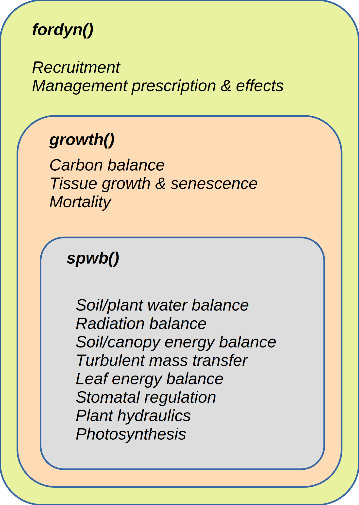
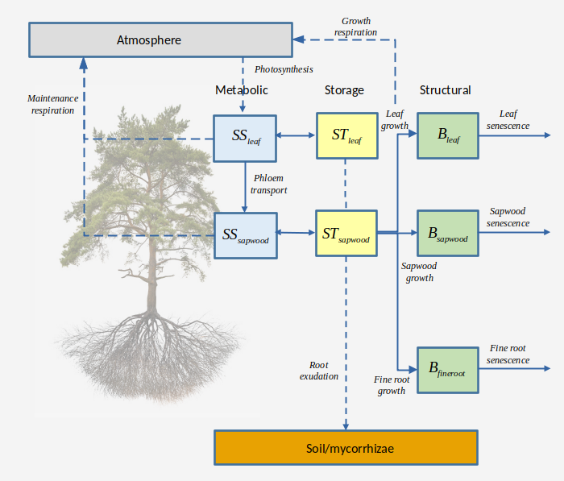

```{r setup, include=FALSE, warning=FALSE}
options(
  htmltools.dir.version = FALSE,
  width = 100
)
knitr::opts_chunk$set(echo = TRUE)
```


```{r, include = FALSE}
library(medfate)
library(cowplot)
```


class: title-slide

# 3.2 - Forest growth/dynamics (theory)

### Miquel De Cáceres, Victor Granda, Aitor Ameztegui

### Ecosystem Modelling Facility

### `r as.Date("2022-06-15")`


---

class: center, middle

<div class=my-header>
    
</div>

<div class=my-footer></div>

# Outline

##  1. Simulation models and processes
##  2. Carbon pools and carbon balance
##  3. Growth and senescence
##  4. Mortality and recruitment


---
layout: true

<div class=my-header>
    
</div>

<div class=my-footer></div>

# 1. Simulation models and processes

---

## Models in medfate and their processes

.pull-left[
Simulation functions in **medfate** have been designed and implemented in a **nested** manner:

+ Each upper-level function includes the processes of lower-level ones and adds new processes.

+ Consequently, the two water balance models (basic and advanced) are available for simulations with `growth()` and `fordyn()`. 

+ In this presentation, we will focus on the state variables and processes that are added in simulations with `growth()` and `fordyn()`. 
]
.pull-right[
    
]

---

## The growth() and fordyn() models

The `growth()` model implements several **daily** processes:

+ Carbon balance processes that modulate changes in *leaf area*, *sapwood area* and *fine root area* of woody plant cohorts.

--

+ Structural changes (diameter and height for trees; cover and height for shrubs) derived from growth and senescence processes. 

--

+ Tree mortality, which reduces cohort density.

--

For applications spanning more than a few years, users will use the `growth()` model indirectly, via calls to `fordyn()`, which includes other processes implemented at **annual** steps:

+ Natural regeneration (recruitment)

--

+ The effect of disturbances (at present, only forest management)


---
layout: true

<div class=my-header>
    
</div>

<div class=my-footer></div>

# 2. Carbon compartments, pools and carbon balance

---

## Carbon compartments and pools

### Types
.font90[
*Structural carbon* - Cell membranes, cell walls & cytosolic machinery.

*Metabolic carbon* - Labile carbon  (sugar) concentration used to sustain cell functioning.

*Storage carbon* - Labile carbon  (starch) concentration used as long-term carbon source.
]

--

.pull-left[
### Pools

.font80[
| Compartment | Structural | Metabolic | Storage |
| ----------- | --------------- | -------------- | ------------ |
| **Leaves**        | Leaf dry biomass $B_{leaf}$ | Leaf sugar $SS_{leaf}$ | Leaf starch $ST_{leaf}$ |
| **Sapwood** (branch/stem/coarse roots)       | Sapwood dry biomass $B_{sapwood}$ | Sapwood sugar $SS_{sapwood}$ | Sapwood starch $ST_{sapwood}$ |
| **Fine roots**    | Fine root dry biomass $B_{fineroot}$ |  |  |
]
]

--

.pull-right[
### Fluxes


]

---

## Labile carbon balance equations

A. Changes in **leaf metabolic** carbon result from considering gross photosynthesis ( $A_{g}$ ), leaf maintenance respiration ( $M_{leaf}$ ), phloem transport ( $F_{phloem}$ ) and sugar-starch dynamics ( $SC_{leaf}$ ) and translocation to sapwood storage ( $TS_{leaf}$ ):

$$\Delta{SS_{leaf}} \cdot V_{storage,leaf} = A_g - M_{leaf} - F_{phloem} - SC_{leaf} - TS_{leaf}$$
--

B. Changes in **leaf storage** carbon result from sugar-starch dynamics and translocation to sapwood storage ( $TT_{leaf}$ ):

$$\Delta{ST_{leaf}} \cdot V_{storage,leaf} = SC_{leaf} - TT_{leaf}$$

--

C. Changes in **stem metabolic** carbon result from considering phloem transport, maintenance respiration of sapwood ( $M_{sapwood}$ ) and fineroot ( $M_{fineroot}$ ) tissues, sugar-starch dynamics and translocation to sapwood storage ( $TS_{sapwood}$ ):

$$\Delta{SS_{sapwood}} \cdot V_{storage,sapwood} = F_{phloem} - M_{sapwood} - M_{fineroot} - SC_{sapwood}  - TS_{sapwood}$$
--

C. Changes in **stem storage** carbon result from considering sugar-starch dynamics, translocation from other pools, growth respiration and root exudation:
.latex12[
$$\Delta{ST_{sapwood}} \cdot V_{storage,sapwood} = SC_{sapwood} + TS_{leaf} + TT_{leaf} + TS_{sapwood} - G_{sapwood} - G_{leaf} - G_{fineroot} - RE_{sapwood}$$
]

---

## Labile carbon balance equations

Changes in labile carbon pools can be reduced to the balance between gross photosynthesis ( $A_g$ ), maintenance ( $M$ ), growth ( $G$ ) and root exudation ( $RE$ ) components:

$$\Delta{S_{labile}} = A_g - M - G - RE$$

.center[

]

---

## Design of labile carbon processes

+ **Phloem transport** is only explicitly modelled when using the **advanced water submodel**, following Hölttä et al. (2017).

<div class=citation-left> Hölttä et al (2017). Tree physiology, 37, 851–868. </div>

--

+ **Sugar/starch dynamics** are meant to keep sugar levels at a prescribed equilibrium value.

--

+ The usual separation between **maintenance** and **growth** respiration is followed, with maintenance costs depending on temperature and phenology.

--

+ **Translocation** of labile carbon towards sapwood storage occurs whenever there is senescence in a given tissue (leaves, branches).

--

+ **Root exudation** is not a process competing for metabolic carbon, but a consequence of plant storage capacity being surpassed (Prescott et al. 2020).

<div class=citation-right> Prescott et al (2020). Trends in Ecology & Evolution, 35, 1110–1118.  </div>

---

## Biomass balance

### Balance in structural carbon pools

The change in structural biomass of each **compartment** results from the interplay between growth and senescence:

$$\Delta{B_{leaves}} = B_{leaves, growth} - B_{leaves, senescence}$$
$$\Delta{B_{sapwood}} = B_{sapwood, growth} - B_{sapwood, senescence}$$
$$\Delta{B_{fineroot}} = B_{fineroot, growth} -  B_{fineroot, senescence}$$

--

The following equation defines the structural biomass balance at the plant level:

$$\Delta{B_{structure}} = \Delta{B_{leaves}} + \Delta{B_{sapwood}} +  \Delta{B_{fineroot}}$$

--

### Balance at the individual level

The biomass balance at the **individual level** is completed if we add the labile biomass balance to the structural biomass balance:

$$\Delta{B_{plant}} = \Delta{B_{structure}} + \Delta{S_{labile}}$$

---

## Biomass balance


### Balance at the cohort level

At the **cohort level** we need to take into account that some individuals will die, so that the biomass balance needs to incorporate mortality losses:

$$\Delta{B_{cohort}} = \Delta{B_{plant}} \cdot N_{cohort} - B_{mortality}$$ 

where $N_{cohort}$ is the initial cohort density (before mortality occurred) and $B_{mortality}$ is the biomass loss due to mortality of individuals, which in order to close the balance has to be defined as:

$$B_{mortality} = (B_{plant} + \Delta{B_{plant}}) \cdot N_{dead}$$

where $N_{dead}$ is the density of dead individuals and $B_{plant}$ is the initial plant biomass.


---
layout: true

<div class=my-header>
    
</div>

<div class=my-footer></div>

# 3. Growth and senescence

---

## Leaf area/fine root biomass growth

Daily leaf area increment $\Delta LA$ and fine root biomass increment $\Delta B_{fineroot}$ are defined as the minimum of three constraints:

$$\Delta LA = \min( \Delta LA_{alloc}, \Delta LA_{source}, \Delta LA_{sink})$$
$$\Delta B_{fineroot} = \min( \Delta B_{fineroot,alloc}, \Delta B_{fineroot,source}, \Delta B_{fineroot,sink})$$

   1. $\Delta LA_{alloc}$ and $\Delta B_{fineroot,alloc}$ are the increments allowed according to the targets set by **allocation rules**.
   2. $\Delta LA_{source}$ and $\Delta B_{fineroot,source}$ are the maximum increments allowed by current **carbon availability**.
   3. $\Delta LA_{sink}$ and $\Delta B_{fineroot,sink}$ are the increments expected by taking into account maximum growth rates as well as **temperature and turgor limitations** (Cabon et al. 2020). 

<div class=citation-right> Cabon et al (2020).  New Phytologist, 226, 1325–1340.  </div>

---

## Sapwood area growth


Daily sapwood formation, $\Delta SA$, is defined as the minimum of two values expressing source and sink constraints:

$$\Delta SA = \min(\Delta SA_{source}, \Delta SA_{sink})$$
--

Unlike leaf area or fine root biomass, sapwood formation is not explicitly constrained by any allocation rule. 

--

However, newly assimilated carbon is preferentially allocated to leaves and fine roots whenever storage levels are low because $\Delta SA_{source}$ is more restrictive than $\Delta LA_{source}$ or $\Delta B_{fineroot,source}$.

---

## Key growth parameters

.font80[
| Parameter | R  | Definition | Explanation    |
| --------- | -- | ---------- | ------------- |
| $RGR_{cambium, max}$ | `RGRcambiummax` | Maximum daily **tree** sapwood growth rate relative to cambium perimeter length | Determines overall maximum growth rates for tree species |
| $RGR_{sapwood, max}$ | `RGRsapwoodmax` | Maximum daily **shrub** sapwood growth rate relative to cambium perimeter length | Determines overall maximum growth rates for shrub species |
| $1/H_v$ | `Al2As` | Leaf area to sapwood area ratio | Determines allocation target for **leaves** |
| $RGR$ | `Ar2Al` | Root area to leaf area ratio | Determines allocation target for **fine roots** and influences root maintenance costs |
| $RSSG$ | `RSSG` | Minimum relative starch for sapwood growth to occur | Determines preference for maintenance over growth under low carbon availability (e.g. shade-tolerant species) |

]


---

## Drivers of tissue senescence


.font90[
| Compartment | Senescence cause | Description    | Key parameter |
| ----------- | ---------------- | -------------- | ------------- |
| Leaf        | Aging            | Defoliation in winter-deciduous. Evergreens lose leaves progressively or suddenly, but with an amount related to leaf lifespan | `LeafDuration`|
|             | Cavitation       | Increases in stem PLC are translated to proportional leaf area losses | |
| Sapwood     | Aging            | Daily rate of conversion from sapwood to heartwood, depending on temperature and plant height | `SRsapwood` |
| Fine root   |  Aging           | Daily rate of senescence depending on temperature | `SRfineroot`|
]

--

*Note*: Stem cavitation reduces functional sapwood but does not lead to heartwood formation.

---

## Updating structural variables

### Trees

New sapwood area, $\Delta SA$, is translated to an increment in DBH, $\Delta DBH$, following:

$$\Delta DBH = 2 \cdot \sqrt{(DBH/2)^2+({\Delta SA}/\pi)} - DBH$$

--

Increments in height are linearly related to increments in diameter through a coefficient depending on light conditions (Lindner et al. 1997), and are limited by a maximum height.

<div class=citation-right> Lindner et al (1997). Forest Ecology and Management, 95, 183–195.  </div>

--

Crown ratios are updated following static allometric relationships

--

### Shrubs

Leaf area changes are translated to changes in shrub volume, cover and shrub height via allometric equations.

--

As for trees, shrub height is limited to a maximum value.

---

layout: true

<div class=my-header>
    
</div>

<div class=my-footer></div>

# 4. Mortality and recruitment

---

## Plant mortality

Dynamic vegetation models implement mortality processes in very different ways, from purely-empirical to process-based (Hawkes 2000).

<div class=citation-right> Hawkes, C. (2000). Ecological Modelling, 126, 225–248.  </div>
 
--

At present, plant mortality is formulated in an overly simplistic way and requires development efforts!

1. Species-specific parameters determine a daily constant **baseline mortality rate**.
  
--
  
2. Daily mortality rates increase due to **carbon starvation** whenever sapwood metabolic carbon, $SS_{sapwood}$, becomes lower than a threshold, set by default to 30% of the homeostatic (equilibrium) concentrations.
  
--

3. Daily mortality rates increase due to **dessication** whenever stem relative water content becomes lower than a pre-specified threshold, set to 30% by default.


---

## Recruitment

Unlike mortality, recruitment is simulated *at the end of a simulated year* (only in `fordyn()`), following the design of many forest gap models.

--

The following conditions need to be met for a species to recruit:

1. Trees of the species are present with a **size above a maturity threshold** (or a seed rain is forced).

--

2. **Mean temperature of the coldest month** is above a bioclimatic threshold.

--

3. The **fraction of light reaching the ground** is above a bioclimatic threshold.

--

4. The **moisture index** (annual precipitation over annual evapotranspiration) is larger than a bioclimatic threshold.

--

When these conditions are met, a **probability of recruitment** is used to stochastically determine whether recruitment actually occurs.

--

Plants are recruited with specified structural characteristics (DBH and height) depending on species parameters.

---
layout: false
class: back-slide


## M.C. Escher - Three worlds, 1955

.center[

]


